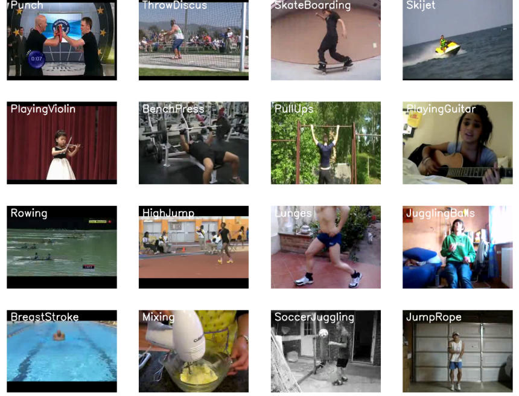

## Human activity recognition using deep learning models 
This project focuses on recognizing human activities from video inputs across 50 different classes using deep learning. The core idea is to combine the strengths of Convolutional Neural Networks (CNNs) for spatial feature extraction and Bidirectional LSTMs (BiLSTMs) for temporal sequence modeling, achieving robust performance on complex video data. 
### setup   
[Download the UCF50 dataset from its official source](https://www.crcv.ucf.edu/data/UCF50.php).

    !wget --no-check-certificate https://www.crcv.ucf.edu/data/UCF50.rar

Run the project on Jupyter [Notebook](https://jupyter.org/install) or [Anaconda](https://www.anaconda.com/download) for easy access.

  Alternatively, use [Google Colab](https://colab.research.google.com/) to avoid environment/library conflicts.

### Key Features
Classifies 50 different human activities from video inputs.
        
Leverages CNNs for spatial representation and BiLSTMs for temporal dynamics.

Built as a research experiment to explore hybrid deep learning architectures for activity recognition.

### Notes

This project was created for research and experimentation purposes, aiming to test the capability of combining CNNs and BiLSTMs in real-world video classification tasks.

